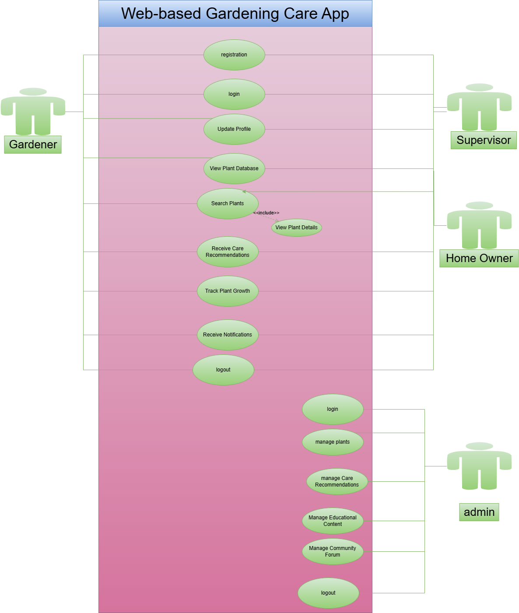
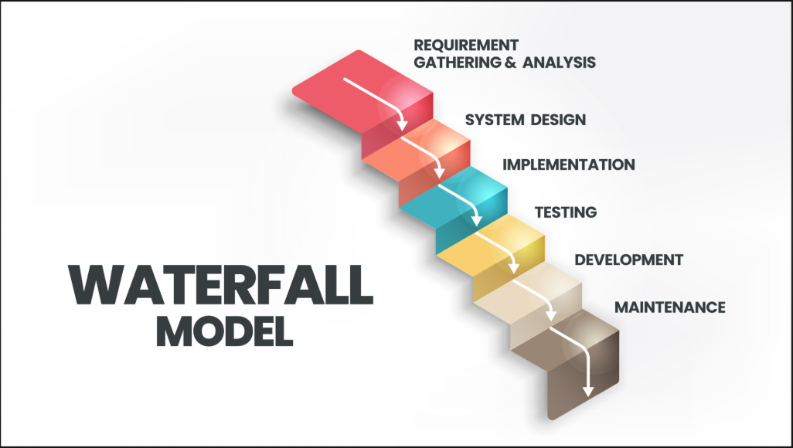
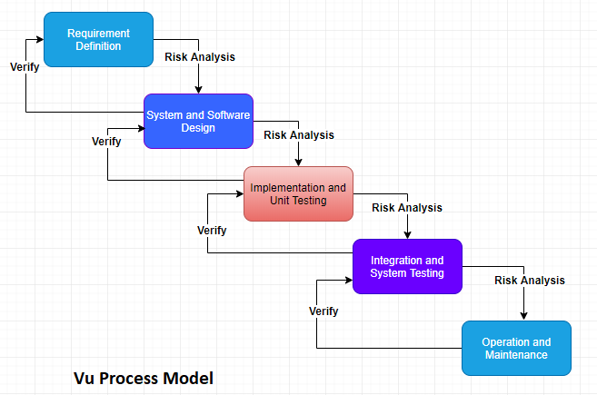
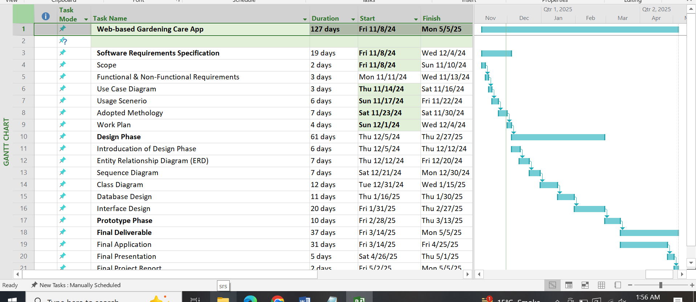

**Style Guidelines for Final Year Project ReportsWeb-Based Gardening
Care App**

**Software Requirements Specification**

**Version 1.0**

  

{width="2.1458333333333335in" height="1.34375in"}

** **

**Group ID: F24PROJECT1A165 (BC200405673)**

**Supervisor Name:** **Haseeb Akmal (haseedakmal@vu.edu.pk)**

**Revision History**

  ----------------- ------------- -------------------------- -------------------------------
  **Date            **Version**   **Description**            **Author**
  (dd/mm/yyyy)**                                             

  29/11/2024        1.0           In this document, we       **[BC200405673]{.underline}**
                                  include different          
                                  document-oriented topics   
                                  to understand how website  
                                  developed, functional and  
                                  non-functional             
                                  requirements, usage        
                                  scenarios, adopted         
                                  methodology, work plan.    

                                                             

                                                             

                                                             
  ----------------- ------------- -------------------------- -------------------------------

**[Table of Contents]{.underline}**

1.  [Scope (of the project)]{.underline} [Page.No.04]{.underline}

2.  [Functional Requirements Non-Functional requirements]{.underline}
    [Page.No.05]{.underline}

3.  [Use Case Diagram]{.underline} [Page.No.07]{.underline}

4.  [[Usage Scenarios]{.underline}](#bookmark=id.2et92p0)
    [Page.No.08]{.underline}

5.  [[Adopted Methodology]{.underline}](#bookmark=id.tyjcwt)
    [Page.No.16]{.underline}

6.  [[Work Plan (Use MS Project to create Schedule/Work
    Plan)]{.underline}](#bookmark=id.3rdcrjn) [Page.No.20]{.underline}

> **[SRS Document]{.underline}**

***[Scope of Project:]{.underline}***

The **Gardening Care Application** is a user-friendly, web-based
platform tailored to assist domestic (home-owner) gardeners in managing
and nurturing their home gardens. Designed to cater to gardeners of all
experience levels, the application provides a wealth of features,
including personalized plant care recommendations based on specific
needs, plant types, and environmental factors. Users can access detailed
plant care schedules, watering reminders, and pest control advice to
ensure healthy growth and thriving plants.

In addition to its practical gardening tools, the application includes
interactive features such as plant identification, gardening tips, and a
virtual garden planner. It also offers a robust community platform that
allows users to connect, share gardening experiences, exchange advice,
and participate in gardening challenges.

The application integrates advanced technology, such as AI-powered plant
health diagnostics and weather forecasting tools, to enhance user
experience and simplify the gardening process. Through its intuitive
design and engaging content, the **Gardening Care Application** aims to
inspire individuals to embrace gardening as a rewarding hobby, promote
sustainability, and foster a deeper connection with nature.

**[Tools & Technologies:]{.underline}**

-   **Frontend Development:**

    -   HTML, CSS, JavaScript

    -   React or Angular (for a modern, component-based framework)

    -   Material UI or Bootstrap (for responsive design and UI
        components)

-   **Backend Development:**

    -   Node.js or Python (for server-side logic and API development)

    -   Express.js or Django (for web frameworks)

    -   MongoDB or PostgreSQL (for database management)

-   **Cloud Platform:**

    -   AWS, GCP, or Azure (for hosting the application and scaling
        resources)

-   **Additional Tools:**

    -   Git (for version control)

    -   NPM or Yarn (for package management)

    -   Webpack or Parcel (for bundling and optimization)

    -   Testing frameworks (e.g., Jest, Mocha)

***[Functional and Non-Functional Requirements:]{.underline}***

**[Functional Requirements:]{.underline}**

-   **User Registration and Profile Management:**

    -   Allow users to create accounts, update personal information, and
        > manage their gardening preferences. The users should include
        > Gardener, Supervisor, Home Owner and System Admin.

-   **Plant Database:**

    -   Maintain a comprehensive database of plants, including their
        > types, characteristics, care requirements, age, growth stages
        > etc. The plants are mainly of three types; flower plants,
        > vegetable plants and fruit plants.

    -   Enable users to search for plants by name, category, or specific
        > attributes.

-   **Personalized Plant Care Recommendations:**

    -   Utilize user-provided data (location, climate, soil type) to
        > offer tailored plant care advice.

    -   Suggest appropriate watering schedules, fertilization plans, and
        > pest control measures.

-   **Plant Tracking and Monitoring:**

    -   Provide features to track plant growth, record observations, and
        > monitor health indicators.

    -   Allow users to set reminders for tasks like watering, repotting,
        > or pruning.

-   **Interactive Tools and Resources:**

    -   Offer interactive tools such as plant identification guides,
        > garden planners, and disease diagnosis assistance.

    -   Provide access to educational resources, articles, and tutorials
        > on various gardening topics.

-   **Community Features:**

    -   Facilitate a community forum / group at Facebook and/or WhatsApp
        > for users to share experiences, ask questions, and connect
        > with other gardeners, home owners etc.

    -   Enable users to create and join gardening groups based on
        > interests or locations. There should be location sharing
        > service for social media platforms.

-   **Alerts:**

    -   Send timely notifications among all users for important tasks,
        > weather updates, or plant-related alerts.

-   **Integration with External Services:**

    -   Consider integrating with weather APIs to provide localized
        > weather forecasts and gardening tips.

    -   Explore partnerships with gardening supply stores or nurseries
        > for product recommendations and discounts.

**[Non-Functional Requirements:]{.underline}**

[This section defines requirements that are not easily defined in the
use case model. Requirements such as legal standards, quality aspects,
supportability and execution criteria of the system. The scope of
the supplementary requirements is limited to all the non-functional
requirements.]{.mark}

-   **Usability:**

> Usability is the degree of ease with which the user will interact with
> your products to achieve required goals effectively and efficiently.

-   **Reliability:**

> Such a metric shows the possibility of your solution to fail. To
> achieve high reliability, your team should eliminate all bugs that may
> influence the code safety and issues with system components. 

-   **Performance:**

> Performance describes how your solution behaves when users interact
> with it in various scenarios. Poor performance may lead to negative
> user experience and jeopardize system safety.

-   **Supportability:**

> System application should be supportable in current equipment such as
> computers monitors, printers, smart-phones etc.

-   **Implementation:**

> The system implementation will be performed all day rather than in
> phases.

***[Use Case Diagram(s):]{.underline}***

{width="5.989583333333333in"
height="7.072916666666667in"}

**[Figure 1.1: Use Case Diagram]{.underline}**

***[Usage Scenarios:]{.underline}***

### Use Case 1: Registration

+-----------------------------------------------------------------------+
| -   **Use Case Title:** Registration                                  |
+=======================================================================+
| -   **Use Case ID:** UC-01                                            |
+-----------------------------------------------------------------------+
| -   **Actors:** Gardener, Supervisor, Home Owner                      |
+-----------------------------------------------------------------------+
| -   **Description:** Users can register themselves in the system by   |
|     providing their details, such as name, role, and email.           |
+-----------------------------------------------------------------------+
| -   **Alternative Path:** If the data is incomplete or invalid, the   |
|     system prompts the user to re-enter the information.              |
+-----------------------------------------------------------------------+
| -   **Pre-Condition:** User must not have an existing account.        |
+-----------------------------------------------------------------------+
| -   **Action:**                                                       |
+-----------------------------------------------------------------------+
| 1.  User navigates to the registration page.                          |
+-----------------------------------------------------------------------+
| 2.  Fills in required information (name, email, role, password).      |
+-----------------------------------------------------------------------+
| 3.  Submits the form.                                                 |
+-----------------------------------------------------------------------+
| 4.  System validates the data and saves the user profile.             |
+-----------------------------------------------------------------------+
| 5.  Confirmation message is shown to the user.                        |
+-----------------------------------------------------------------------+
| -   **Post-Condition:** User account is created successfully.         |
+-----------------------------------------------------------------------+
| -   **Exception:** Registration fails if the email is already used or |
|     data is invalid.                                                  |
+-----------------------------------------------------------------------+
| -   **Author:** BC200405673                                           |
+-----------------------------------------------------------------------+

### Use Case 2: Login

+-----------------------------------------------------------------------+
| -   **Use Case Title:** Login                                         |
+=======================================================================+
| -   **Use Case ID:** UC-02                                            |
+-----------------------------------------------------------------------+
| -   **Actors:** Gardener, Supervisor, Home Owner, Admin               |
+-----------------------------------------------------------------------+
| -   **Description:** Users can log in to the system using their       |
|     registered email and password.                                    |
+-----------------------------------------------------------------------+
| -   **Alternative Path:** If incorrect credentials are entered, the   |
|     system displays an error message.                                 |
+-----------------------------------------------------------------------+
| -   **Pre-Condition:** The user must already be registered.           |
+-----------------------------------------------------------------------+
| -   **Action:**                                                       |
+-----------------------------------------------------------------------+
| 1.  User navigates to the login page.                                 |
+-----------------------------------------------------------------------+
| 2.  Enters email and password.                                        |
+-----------------------------------------------------------------------+
| 3.  System verifies credentials.                                      |
+-----------------------------------------------------------------------+
| 4.  If correct, the user is logged in and redirected to their         |
|     dashboard.                                                        |
+-----------------------------------------------------------------------+
| -   **Post-Condition:** User is successfully logged into the system.  |
+-----------------------------------------------------------------------+
| -   **Exception:** Login fails if the credentials are invalid or the  |
|     account is locked.                                                |
+-----------------------------------------------------------------------+
| -   **Author:** BC200405673                                           |
+-----------------------------------------------------------------------+

### Use Case 3: Update Profile

+-----------------------------------------------------------------------+
| -   **Use Case Title:** Update Profile                                |
+=======================================================================+
| -   **Use Case ID:** UC-03                                            |
+-----------------------------------------------------------------------+
| -   **Actors:** Gardener, Supervisor, Home Owner                      |
+-----------------------------------------------------------------------+
| -   **Description:** Users can update their personal details and      |
|     gardening preferences in their profile.                           |
+-----------------------------------------------------------------------+
| -   **Alternative Path:** If the update fails, the system notifies    |
|     the user.                                                         |
+-----------------------------------------------------------------------+
| -   **Pre-Condition:** User must be logged in.                        |
+-----------------------------------------------------------------------+
| -   **Action:**                                                       |
+-----------------------------------------------------------------------+
| 1.  User navigates to the profile section.                            |
+-----------------------------------------------------------------------+
| 2.  Updates personal information or preferences.                      |
+-----------------------------------------------------------------------+
| 3.  Submits the changes.                                              |
+-----------------------------------------------------------------------+
| 4.  System validates and saves the updates.                           |
+-----------------------------------------------------------------------+
| -   **Post-Condition:** Profile is updated successfully.              |
+-----------------------------------------------------------------------+
| -   **Exception:** Update fails if required fields are missing or     |
|     invalid.                                                          |
+-----------------------------------------------------------------------+
| -   **Author:** BC200405673                                           |
+-----------------------------------------------------------------------+

### Use Case 4: View Plant Database

+-----------------------------------------------------------------------+
| -   **Use Case Title:** View Plant Database                           |
+=======================================================================+
| -   **Use Case ID:** UC-04                                            |
+-----------------------------------------------------------------------+
| -   **Actors:** Gardener, Supervisor, Home Owner                      |
+-----------------------------------------------------------------------+
| -   **Description:** Users can browse the comprehensive plant         |
|     database, including details like types, care requirements, and    |
|     growth stages.                                                    |
+-----------------------------------------------------------------------+
| -   **Alternative Path:** N/A                                         |
+-----------------------------------------------------------------------+
| -   **Pre-Condition:** User must be logged in.                        |
+-----------------------------------------------------------------------+
| -   **Action:**                                                       |
+-----------------------------------------------------------------------+
| 1.  User navigates to the plant database.                             |
+-----------------------------------------------------------------------+
| 2.  Browses the available plants.                                     |
+-----------------------------------------------------------------------+
| 3.  Selects a plant to view detailed information.                     |
+-----------------------------------------------------------------------+
| -   **Post-Condition:** User can view plant details.                  |
+-----------------------------------------------------------------------+
| -   **Exception:** Database access fails due to server issues.        |
+-----------------------------------------------------------------------+
| -   **Author:** BC200405673                                           |
+-----------------------------------------------------------------------+

### Use Case 5: Search Plants

+-----------------------------------------------------------------------+
| -   **Use Case Title:** Search Plants                                 |
+=======================================================================+
| -   **Use Case ID:** UC-05                                            |
+-----------------------------------------------------------------------+
| -   **Actors:** Gardener, Supervisor, Home Owner                      |
+-----------------------------------------------------------------------+
| -   **Description:** Users can search for plants by name, category,   |
|     or attributes.                                                    |
+-----------------------------------------------------------------------+
| -   **Alternative Path:** If no results are found, a message is       |
|     displayed to the user.                                            |
+-----------------------------------------------------------------------+
| -   **Pre-Condition:** User must be logged in.                        |
+-----------------------------------------------------------------------+
| -   **Action:**                                                       |
+-----------------------------------------------------------------------+
| 1.  User enters a search query.                                       |
+-----------------------------------------------------------------------+
| 2.  System processes the query and fetches matching results.          |
+-----------------------------------------------------------------------+
| 3.  Results are displayed to the user.                                |
+-----------------------------------------------------------------------+
| -   **Post-Condition:** Search results are displayed.                 |
+-----------------------------------------------------------------------+
| -   **Exception:** Search fails if the query is invalid or the        |
|     database is inaccessible.                                         |
+-----------------------------------------------------------------------+
| -   **Author:** BC200405673                                           |
+-----------------------------------------------------------------------+

### Use Case 6: Receive Care Recommendations

+-----------------------------------------------------------------------+
| -   **Use Case Title:** Receive Care Recommendations                  |
+=======================================================================+
| -   **Use Case ID:** UC-06                                            |
+-----------------------------------------------------------------------+
| -   **Actors:** Gardener, Supervisor, Home Owner                      |
+-----------------------------------------------------------------------+
| -   **Description:** Users receive personalized plant care advice     |
|     based on their preferences and plant details.                     |
+-----------------------------------------------------------------------+
| -   **Alternative Path:** N/A                                         |
+-----------------------------------------------------------------------+
| -   **Pre-Condition:** User must have a plant registered in the       |
|     system.                                                           |
+-----------------------------------------------------------------------+
| -   **Action:**                                                       |
+-----------------------------------------------------------------------+
| 1.  User views care recommendations.                                  |
+-----------------------------------------------------------------------+
| 2.  System generates advice based on plant type, location, and        |
|     climate.                                                          |
+-----------------------------------------------------------------------+
| 3.  Displays recommendations such as watering schedules and pest      |
|     control tips.                                                     |
+-----------------------------------------------------------------------+
| -   **Post-Condition:** User receives care recommendations.           |
+-----------------------------------------------------------------------+
| -   **Exception:** System fails to generate recommendations due to    |
|     missing data.                                                     |
+-----------------------------------------------------------------------+
| -   **Author:** BC200405673                                           |
+-----------------------------------------------------------------------+

### Use Case 7: Track Plant Growth

+-----------------------------------------------------------------------+
| -   **Use Case Title:** Track Plant Growth                            |
+=======================================================================+
| -   **Use Case ID:** UC-07                                            |
+-----------------------------------------------------------------------+
| -   **Actors:** Gardener, Supervisor                                  |
+-----------------------------------------------------------------------+
| -   **Description:** Users can track and monitor plant growth,        |
|     including health indicators and stages.                           |
+-----------------------------------------------------------------------+
| -   **Alternative Path:** N/A                                         |
+-----------------------------------------------------------------------+
| -   **Pre-Condition:** User must have a plant registered in the       |
|     system.                                                           |
+-----------------------------------------------------------------------+
| -   **Action:**                                                       |
+-----------------------------------------------------------------------+
| 1.  User records plant observations.                                  |
+-----------------------------------------------------------------------+
| 2.  System logs and updates the growth data.                          |
+-----------------------------------------------------------------------+
| 3.  User can review historical growth data.                           |
+-----------------------------------------------------------------------+
| -   **Post-Condition:** Plant growth data is recorded and accessible. |
+-----------------------------------------------------------------------+
| -   **Exception:** Tracking fails due to invalid data or system       |
|     issues.                                                           |
+-----------------------------------------------------------------------+
| -   **Author:** BC200405673                                           |
+-----------------------------------------------------------------------+

### Use Case 8: Receive Notifications

+-----------------------------------------------------------------------+
| -   **Use Case Title:** Receive Notifications                         |
+=======================================================================+
| -   **Use Case ID:** UC-08                                            |
+-----------------------------------------------------------------------+
| -   **Actors:** Gardener, Supervisor, Home Owner                      |
+-----------------------------------------------------------------------+
| -   **Description:** Users receive timely notifications for tasks,    |
|     weather updates, or plant alerts.                                 |
+-----------------------------------------------------------------------+
| -   **Alternative Path:** N/A                                         |
+-----------------------------------------------------------------------+
| -   **Pre-Condition:** User must have a registered account.           |
+-----------------------------------------------------------------------+
| -   **Action:**                                                       |
+-----------------------------------------------------------------------+
| 1.  System sends relevant notifications.                              |
+-----------------------------------------------------------------------+
| 2.  User views and acts upon notifications.                           |
+-----------------------------------------------------------------------+
| -   **Post-Condition:** Notifications are delivered successfully.     |
+-----------------------------------------------------------------------+
| -   **Exception:** Notification fails due to server issues.           |
+-----------------------------------------------------------------------+
| -   **Author:** BC200405673                                           |
+-----------------------------------------------------------------------+

### Use Case 9: Manage Plants (Admin)

+-----------------------------------------------------------------------+
| -   **Use Case Title:** Manage Plants                                 |
+=======================================================================+
| -   **Use Case ID:** UC-09                                            |
+-----------------------------------------------------------------------+
| -   **Actors:** Admin                                                 |
+-----------------------------------------------------------------------+
| -   **Description:** Admin can add, update, or remove plants in the   |
|     database.                                                         |
+-----------------------------------------------------------------------+
| -   **Alternative Path:** N/A                                         |
+-----------------------------------------------------------------------+
| -   **Pre-Condition:** Admin must be logged in.                       |
+-----------------------------------------------------------------------+
| -   **Action:**                                                       |
+-----------------------------------------------------------------------+
| 1.  Admin navigates to the plant management section.                  |
+-----------------------------------------------------------------------+
| 2.  Adds, updates, or deletes plants.                                 |
+-----------------------------------------------------------------------+
| 3.  Changes are saved to the database.                                |
+-----------------------------------------------------------------------+
| -   **Post-Condition:** Database is updated.                          |
+-----------------------------------------------------------------------+
| -   **Exception:** Database update fails due to invalid data or       |
|     server issues.                                                    |
+-----------------------------------------------------------------------+
| -   **Author:** BC200405673                                           |
+-----------------------------------------------------------------------+

### Use Case 10: Manage Educational Content (Admin)

+-----------------------------------------------------------------------+
| -   **Use Case Title:** Manage Educational Content                    |
+=======================================================================+
| -   **Use Case ID:** UC-10                                            |
+-----------------------------------------------------------------------+
| -   **Actors:** Admin                                                 |
+-----------------------------------------------------------------------+
| -   **Description:** Admin can add, update, or remove gardening       |
|     resources and tutorials.                                          |
+-----------------------------------------------------------------------+
| -   **Alternative Path:** N/A                                         |
+-----------------------------------------------------------------------+
| -   **Pre-Condition:** Admin must be logged in.                       |
+-----------------------------------------------------------------------+
| -   **Action:**                                                       |
+-----------------------------------------------------------------------+
| 1.  Admin navigates to the educational content section.               |
+-----------------------------------------------------------------------+
| 2.  Adds, updates, or deletes resources.                              |
+-----------------------------------------------------------------------+
| 3.  Changes are saved.                                                |
+-----------------------------------------------------------------------+
| -   **Post-Condition:** Educational content is updated.               |
+-----------------------------------------------------------------------+
| -   **Exception:** Content update fails due to server issues.         |
+-----------------------------------------------------------------------+
| -   **Author:** BC200405673                                           |
+-----------------------------------------------------------------------+

### Use Case 11: Manage Community Forum (Admin)

+-----------------------------------------------------------------------+
| -   **Use Case Title:** Manage Community Forum                        |
+=======================================================================+
| -   **Use Case ID:** UC-11                                            |
+-----------------------------------------------------------------------+
| -   **Actors:** Admin                                                 |
+-----------------------------------------------------------------------+
| -   **Description:** Admin moderates the community forum, including   |
|     posts and discussions.                                            |
+-----------------------------------------------------------------------+
| -   **Alternative Path:** N/A                                         |
+-----------------------------------------------------------------------+
| -   **Pre-Condition:** Admin must be logged in.                       |
+-----------------------------------------------------------------------+
| -   **Action:**                                                       |
+-----------------------------------------------------------------------+
| 1.  Admin reviews posts and discussions.                              |
+-----------------------------------------------------------------------+
| 2.  Approves, edits, or deletes content as necessary.                 |
+-----------------------------------------------------------------------+
| -   **Post-Condition:** Community forum is moderated.                 |
+-----------------------------------------------------------------------+
| -   **Exception:** Forum moderation fails due to connectivity issues. |
+-----------------------------------------------------------------------+
| -   **Author:** BC200405673                                           |
+-----------------------------------------------------------------------+

***[Adopted Methodology:]{.underline}***

The approach selected for this project is the V-Model, a hybrid
methodology that combines elements from both the Waterfall model and the
Spiral model. This blended approach brings several key advantages,
particularly in terms of risk management. The V-Model emphasizes
thorough risk analysis, which allows for the effective identification
and mitigation of potential risks at each phase of the project.
Additionally, the model is known for its clarity and simplicity, making
it both easy to understand and implement for project teams.

To begin, we will first explore the fundamentals of the Waterfall model,
which forms the backbone of the V-Model's structure. This model is
sequential, with each phase of development serving as a foundation for
the next, offering clear stages and well-defined deliverables.

**[WATER FALL MODEL:]{.underline}**

{width="6.0in" height="3.3854166666666665in"}

**[Figure 1.2: Waterfall Model]{.underline}**

The Waterfall Model was the first process model introduced in software
development, often referred to as the linear-sequential life cycle
model. It is a straightforward and easy-to-understand methodology. In
the Waterfall Model, each phase must be completed before the next one
can begin, with no overlap between phases. This sequential flow of
stages offers a structured approach, making it one of the earliest and
most widely used SDLC models. In the Waterfall Model, development
progresses in a linear sequence, meaning that one phase starts only
after the previous phase is fully completed. The model encompasses
several distinct stages, beginning with the requirements phase and
concluding with the acceptance phase.

**1. Requirement Gathering and Analysis:** This initial phase focuses on
gathering and documenting all the requirements for the system to be
developed. It culminates in the creation of a detailed requirement
specification document, which serves as the foundation for the next
stages.

**2. System Design:** In this phase, the requirement specifications from
the previous stage are thoroughly analyzed to prepare the system design.
The system design defines the hardware and software requirements, as
well as the overall architecture of the system, setting the groundwork
for development.

**3. Implementation:** With the system design in place, development
begins. The system is built in smaller units, each of which is
individually tested for functionality in a process known as unit
testing. These units are later integrated into the full system in the
next phase.

**4. Integration and Testing:** Once all individual units are developed
and tested, they are integrated into a complete system. The system is
then subjected to rigorous testing to identify and fix any faults or
failures.

**5. Deployment:** After the system has passed all functional and
non-functional tests, it is deployed into the user environment where it
becomes operational.

**6. Maintenance:** After deployment, issues may arise in the user
environment. These are addressed through patches and updates. Ongoing
maintenance ensures that the system continues to meet user needs and
remains functional.

Next, we will explore the Spiral Model and the V-Model.

**Spiral Model:**

The Spiral Model is employed to minimize the risks associated with
software development. This methodology is particularly useful in
situations where the potential risks could significantly affect the
project, such as the loss of key personnel.

1.  **Risk Management Focus:** The primary strength of the Spiral Model
    is its focus on risk assessment and mitigation. It allows for
    iterative refinement and evaluation at each phase, ensuring that
    risks are identified and addressed early in the process.

2.  **Two Key Dimensions:** The Spiral Model operates on two dimensions:
    the **radial dimension**, which represents the cumulative cost of
    the project up to that point, and the **angular dimension**, which
    tracks the progress made through the spiral.

3.  **Parallel Development and Maintenance:** Unlike the Waterfall
    Model, the Spiral Model allows for the development and maintenance
    phases to run in parallel, making it suitable for large-scale or
    in-house software projects that require continuous iteration and
    adjustments.

**[VU PROCESS MODEL:]{.underline}**

{width="5.875in" height="4.34375in"}

**[Figure 1.3: VU Process Model]{.underline}**

The VU Process Model is a hybrid methodology that combines elements of
both the Waterfall and Spiral models. This integrated approach aims to
maximize the quality of the system while minimizing risks and addressing
the disadvantages of each individual model. By merging these two
methodologies, the VU Process Model offers a structured yet flexible
framework for development, ensuring better control over project
execution and more reliable outcomes.

### **Reasons for Choosing the VU Process Model:**

The project has been broken down into distinct stages, such as
requirement gathering and analysis, planning, design and analysis,
development, and the final report/viva stage. Each stage will be
completed in sequence, and at the end of each phase, it will be
submitted to our supervisor for review. The supervisor will provide
feedback and suggest improvements for the current stage before we
proceed to the next one. Any necessary modifications will be made based
on this feedback.

The reason we are adopting this approach is due to the iterative nature
of the Spiral Model, which allows for continuous improvement at each
phase. When a stage is fully refined, well-executed, and approved by the
supervisor, we will move on to the next phase. This ensures that each
stage is meticulously completed, aligning with the Waterfall Model's
sequential approach. By combining these two models, the VU Process Model
guarantees a systematic, error-free outcome, as each step is thoroughly
reviewed and optimized before moving forward.

The VU Process Model incorporates elements of both the Waterfall and
Spiral models, offering a balanced approach to software development.
This hybrid methodology enhances system quality while minimizing risks
and limitations. The VU Process consists of four main stages, which
further divide the phases of the Waterfall model. These stages are
repeated until the system meets the client's requirements, ensuring a
comprehensive and iterative approach to development.

***[Work Plan (Use MS Project to create Schedule/Work
Plan):]{.underline}***

{width="5.989583333333333in"
height="2.6041666666666665in"}

**[Figure 1.4: Work Plan Diagram]{.underline}**
