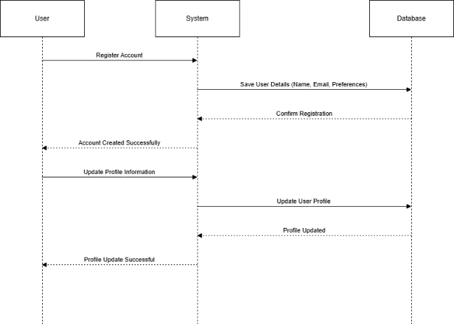
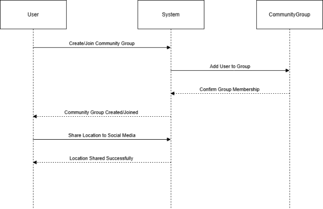

Style Guidelines for Final Year Project Reports**Online DRC**

**Design Document**

**Version 1.0**

** 

**Group ID: F24PROJECT1A165 (BC200405673)**

**Supervisor Name:** **Haseeb Akmal (haseebakmal@vu.edu.pk)***	 

**

**Revision History**

|**Date (dd/mm/yyyy)**|**Version**|**Description**|**Author**|
| :-: | :-: | :-: | :-: |
|27/01/2025|1\.0|
This document outlines various aspects of the application, including its design and implementation structure:

- Introduction

- Entity-Relationship Diagram (ERD)

- Sequence Diagram

- Architecture Diagram

- Class Diagram

- Database Diagram

- Interface Design

- Test Cases
|BC200405673|
|||||
|||||
|||||

**Table of Contents**

**										                       

1. [Introduction of Design Document](#_introduction_of_design)			      
1. [Entity Relationship Diagram (ERD)](#erd)
1. [Sequence Diagrams](#six)	
1. [Architecture Design Diagram](#seven) 	
1. [Class Diagram	](#class)				
1. [Database Design](#databasedesign)
1. [Interface Design](#interfacedesign)
1. [Test Cases](#testcases)				
**\

**Design Document**

1. # **Introduction of Design Document:**
This phase includes the following components:

- Entity Relationship Diagram (ERD)
- Sequence Diagram
- Architecture Design Diagram
- Class Diagram
- Database Design
- Interface Design
- Test Cases
  1. ## **Entity Relationship Diagram (ERD)**
The ERD visually depicts the relationships between entities in a given scenario. An entity is an independently existing object uniquely identified by a primary key.
1. ## **Sequence Diagrams**
Sequence Diagrams illustrate the flow of messages and interactions between the user and objects/classes. It can also be seen as a logical representation of system development.
1. ## **Architecture Design Diagram**
The Architecture Design Diagram visually represents the structure of the budget planner in layered form, including the Application Layer, Business Logic Layer, and Data Link Layer.
1. ## **Class Diagram**
A Class Diagram provides a static overview of all classes, their attributes, methods, and relationships with other classes. It uses UML diagram techniques to represent the classes within the system.
1. ## **Database Design**
This section outlines the backend database structure, showing data organized into tables and rows. It also illustrates the logical design of databases and the relationships between tables.
1. ## **Interface Design**
To simplify interaction with the complex backend structure, we use a Graphical User Interface (GUI). This visually designed interface allows users to interact with the application easily.
1. ## **Test Cases**
Test Cases represent the functionalities and features of the online budget planner application, ensuring that each feature or function works correctly. Test cases are executed using various conditions and tools.

1. # **Entity Relationship Diagram (ERD):**

1. # **Sequence Diagrams:**

1. ## **Registration and Profile Management:** 

1. ## **Search Plants:** 

1. ## **Personalized Plant Care Recommendations:**

1. ## **Plant Tracking and Monitoring:**

1. ## **Interactive Tools and Resources:**

1. ## **Community Features:** 

1. ## **Alerts:**

1. ## **Integration with External Services:** 

1. # **Architecture Design Diagram:**

1. # **Class Diagram:**

1. # **Database Design:**

1. # **Interface Design:**

Some conceptual screenshots (GUI) of the system are as follow:
1. ## **Login Screen:** 

1. ## **Signup Screen:**

1. ## **Admin Dashboard Screen:** 

1. # **Test Cases:**

1. ## **Registration:** 

|<h1>**Test Case #1**</h1>|**Registration**|
| :- | :- |
|Preconditions|The user must not have an existing account.|
|Actions|
The user navigates to the registration page.

Fills in the required information (name, email, role, password).

Submits the form.

The system validates the data and saves the user profile.

A confirmation message is shown to the user.
|
|Expected Results|A confirmation message is displayed, and the user account is created successfully.|
|Tested By |Muhammad Abu Bakar (BC200405673)|
|Result|Pass/Fail|

1. ## **Login:** 

|**Test Case #2**|**Login**|
| :- | :- |
|Preconditions|The user must already be registered.|
|Actions|
The user navigates to the login page.

Enters email and password.

The system verifies credentials.

If correct, the user is logged in and redirected to their dashboard.
|
|Expected Results|The user is successfully logged into the system.|
|Tested By|Muhammad Abu Bakar (BC200405673)|
|Result|Pass/Fail|

1. ## **Update Profile:** 

|**Test Case #3**|**Update Profile**|
| :- | :- |
|Preconditions|The user must be logged in.|
|Actions|
The user navigates to the profile section.

Updates personal information or preferences.

Submits the changes.

The system validates and saves the updates.
|
|Expected Results|The profile is updated successfully.|
|Tested By|Muhammad Abu Bakar (BC200405673)|
|Result|Pass/Fail|

1. ## **View Plant Database:** 

|**Test Case #4**|**View Plant Database**|
| :- | :- |
|Preconditions|The user must be logged in.|
|Actions|
The user navigates to the plant database.

Browses the available plants.

Selects a plant to view detailed information.
|
|Expected Results|The user can view plant details.|
|Tested By|Muhammad Abu Bakar (BC200405673)|
|Result|Pass/Fail|

1. ## **Search Plants:** 

|**Test Case #5**|**Search Plants**|
| :- | :- |
|Preconditions|The user must be logged in.|
|Actions|
The user enters a search query.

The system processes the query and fetches matching results.

Results are displayed to the user.
|
|Expected Results|Search results are displayed.|
|Tested By|Muhammad Abu Bakar (BC200405673)|
|Result|Pass/Fail|

1. ## **Receive Care Recommendations:** 

|**Test Case #6**|**Receive Care Recommendations**|
| :- | :- |
|Preconditions|The user must have a plant registered in the system.|
|Actions|
The user views care recommendations.

The system generates advice based on plant type, location, and climate.

Displays recommendations such as watering schedules and pest control tips.
|
|Expected Results|The user receives care recommendations.|
|Tested By|Muhammad Abu Bakar (BC200405673)|
|Result|Pass/Fail|

1. ## **Track Plant Growth:** 

|**Test Case #7**|**Track Plant Growth**|
| :- | :- |
|Preconditions|The user must have a plant registered in the system.|
|Actions|
The user records plant observations.

The system logs and updates the growth data.

The user can review historical growth data.
|
|Expected Results|Plant growth data is recorded and accessible.|
|Tested By|Muhammad Abu Bakar (BC200405673)|
|Result|Pass/Fail|

1. ## **Receive Notifications:** 

|**Test Case #8**|**Receive Notifications**|
| :- | :- |
|Preconditions|The user must have a registered account.|
|Actions|
The system sends relevant notifications.

The user views and acts upon notifications.
|
|Expected Results|Notifications are delivered successfully.|
|Tested By|Muhammad Abu Bakar (BC200405673)|
|Result|Pass/Fail|

1. ## **Manage Plants (Admin):** 

|**Test Case #9**|**Manage Plants**|
| :- | :- |
|Preconditions|The admin must be logged in.|
|Actions|
The admin navigates to the plant management section.

Adds, updates, or deletes plants.

Changes are saved to the database.
|
|Expected Results|The database is updated.|
|Tested By|Muhammad Abu Bakar (BC200405673)|
|Result|Pass/Fail|

1. ## ` `**Manage Educational Content (Admin):** 

|**Test Case #10**|**Manage Educational Content**|
| :- | :- |
|Preconditions|The admin must be logged in.|
|Actions|
The admin navigates to the educational content section.

Adds, updates, or deletes resources.

Changes are saved.
|
|Expected Results|Educational content is updated.|
|Tested By|Muhammad Abu Bakar (BC200405673)|
|Result|Pass/Fail|

1. ## ` `**Manage Community Forum (Admin):** 

|**Test Case #11**|**Manage Community Forum**|
| :- | :- |
|Preconditions|The admin must be logged in.|
|Actions|
The admin reviews posts and discussions.

Approves, edits, or deletes content as necessary.
|
|Expected Results|The community forum is moderated.|
|Tested By|Muhammad Abu Bakar (BC200405673)|
|Result|Pass/Fail|

